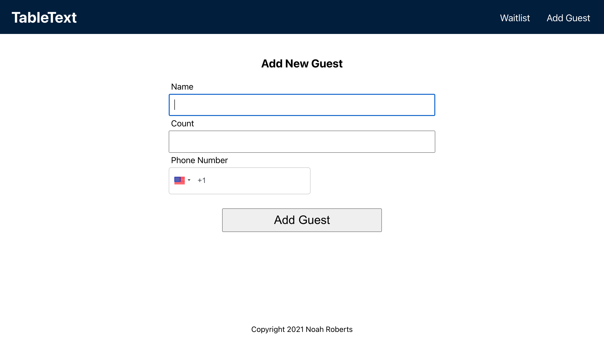

# [TableText](https://tabletext.vercel.app/)

## Summary

This is the React client for [TableText](https://tabletext.vercel.app/), a web app designed to help restaurants keep a waiting list with the ability to text guests when their table is ready. It talks to the TableText API which you can find [here](https://github.com/noahthedev/tabletext-api).

## Tech Stack

- React.js
- CSS
- Node.js
- Express
- PostgreSQL

## Screenshots

### Waitlist

 
### Guest Page 

### Add Guest

